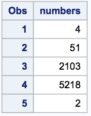
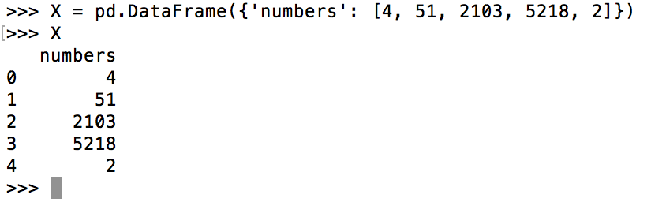

```{r setup, include=FALSE}
knitr::opts_chunk$set(echo = TRUE)
```

## Problem 1

Here is the creation of the **X Matrix*

#### SAS...

```
data x;
input numbers @@;
datalines;
4 51 2103 5218 2
;
run;

proc print data = x;
```


#### Python...


#### R...
```{r}
numbers = c(4, 51, 2103, 5218, 2)
X = data.frame(numbers)
X
```

## Problem 2

First we use the package `tseries` and then download the data
```{r}
library('tseries')
SNPdata = get.hist.quote('gwph', quote='Close')
```

Then, calculate log returns

```{r}
SNPreturns = log(lag(SNPdata)) - log(SNPdata)
```

Create function to calculate volatility

```{r}
getVol = function(d, logrets) {
  var = 0
  lam = 0
  varlist = c()
  for (r in logrets) {
    lam = lam*(1 - 1/d) + 1
    var = (1 - 1/lam)*var + (1/lam) * r^2
    varlist = c(varlist, var)
  }
  
  sqrt(varlist)
}
```

Calculate the volatility for data, assuming about 250 days of trade per year

```{r}
SNPvol = sd(SNPreturns) * sqrt(250) * 100
```

Calculate the *weighted* volatility from our  S&P data using increasingly strong decay factors .90, .97, .99 respectively...

```{r}
volest = getVol(10, SNPreturns)
volest2 = getVol(30, SNPreturns)
volest3 = getVol(100, SNPreturns)
```

Volatility estimates displayed on same plot

```{r}
plot(volest, type="l")
lines(volest2, type="l", col='red')
lines(volest3, type="l", col='green')
```

### Problem 3

Calculate mean and median circumference for different sizes of orange trees

```
tapply(Orange$circumference, Orange$Tree, mean)
tapply(Orange$circumference, Orange$Tree, median)
```

Plot the trees with their circumference versus their age. Color each point based on the tree's size:

```{r}
Circumference = Orange$circumference
Age = Orange$age

plot(Circumference, Age, pch=c(24, 25, 21, 22, 23), col=c('red', 'blue', 'green', 'cyan', 'black'))
legend(30, 1500, pch=c(24, 25, 21, 22, 23), legend = paste("size", c(1, 2, 3, 4, 5)), title="Tree Sizes", col=c('red', 'blue', 'green', 'cyan', 'black'), bty='n', cex=.8, xpd = FALSE)
```

Compare each of the sizes of trees against their diameters using box plots:

```{r}
sortedData = Orange[order(Orange$circumference),]
boxplot(sortedData$circumference ~ sortedData$Tree)
```
