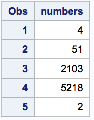
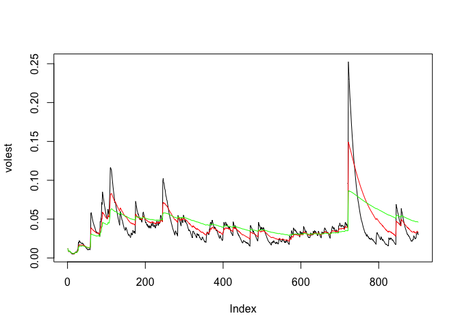
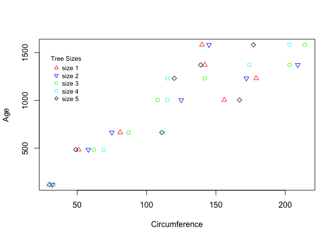
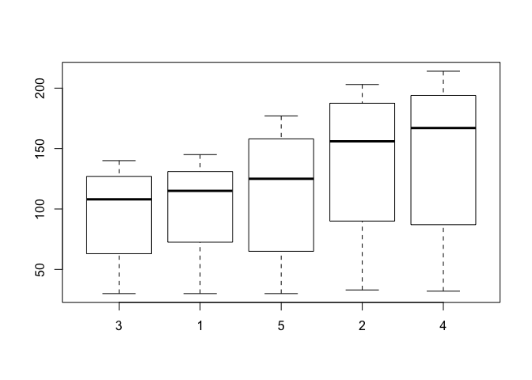
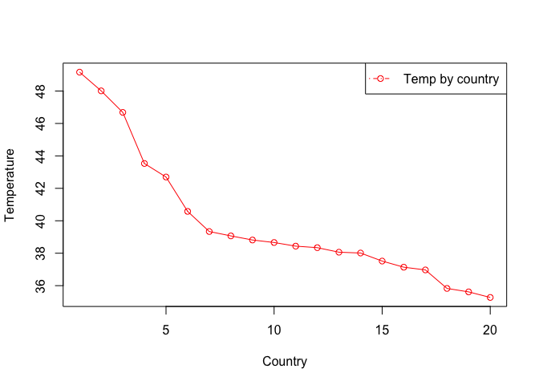
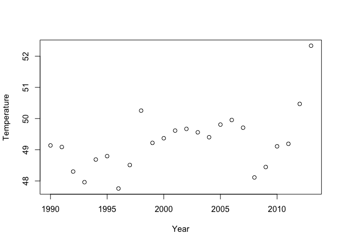
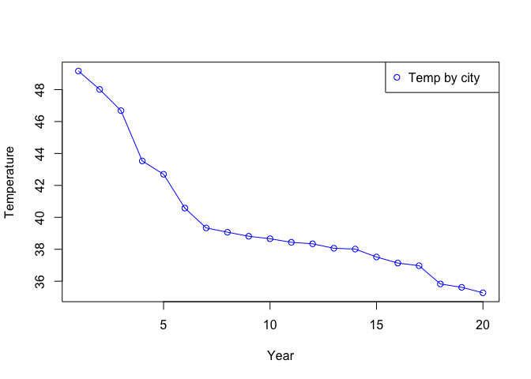
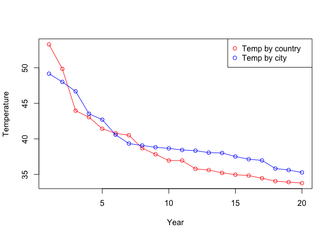

Case Study 2
================

Problem 1
---------

Here is the creation of the \*\*X Matrix\*

#### SAS...

    data x;
    input numbers @@;
    datalines;
    4 51 2103 5218 2
    ;
    run;

    proc print data = x;



#### Python...


#### R...

``` r
numbers = c(4, 51, 2103, 5218, 2)
X = data.frame(numbers)
X
```

    ##   numbers
    ## 1       4
    ## 2      51
    ## 3    2103
    ## 4    5218
    ## 5       2

Problem 2
---------

First we use the package `tseries` and then download the data

``` r
library('tseries')
SNPdata = get.hist.quote('gwph', quote='Close')
```

    ## time series starts 2013-05-01

Then, calculate log returns

``` r
SNPreturns = log(lag(SNPdata)) - log(SNPdata)
```

Create function to calculate volatility

``` r
getVol = function(d, logrets) {
  var = 0
  lam = 0
  varlist = c()
  for (r in logrets) {
    lam = lam*(1 - 1/d) + 1
    var = (1 - 1/lam)*var + (1/lam) * r^2
    varlist = c(varlist, var)
  }
  
  sqrt(varlist)
}
```

Calculate the volatility for data, assuming about 250 days of trade per year

``` r
SNPvol = sd(SNPreturns) * sqrt(250) * 100
```

Calculate the *weighted* volatility from our S&P data using increasingly strong decay factors .90, .97, .99 respectively...

``` r
volest = getVol(10, SNPreturns)
volest2 = getVol(30, SNPreturns)
volest3 = getVol(100, SNPreturns)
```

Volatility estimates displayed on same plot

``` r
plot(volest, type="l")
lines(volest2, type="l", col='red')
lines(volest3, type="l", col='green')
```



### Problem 3

Calculate mean and median circumference for different sizes of orange trees

    tapply(Orange$circumference, Orange$Tree, mean)
    tapply(Orange$circumference, Orange$Tree, median)

Plot the trees with their circumference versus their age. Color each point based on the tree's size:

``` r
Circumference = Orange$circumference
Age = Orange$age

plot(Circumference, Age, pch=c(24, 25, 21, 22, 23), col=c('red', 'blue', 'green', 'cyan', 'black'))
legend(30, 1500, pch=c(24, 25, 21, 22, 23), legend = paste("size", c(1, 2, 3, 4, 5)), title="Tree Sizes", col=c('red', 'blue', 'green', 'cyan', 'black'), bty='n', cex=.8, xpd = FALSE)
```



Compare each of the sizes of trees against their diameters using box plots:

``` r
sortedData = Orange[order(Orange$circumference),]
boxplot(sortedData$circumference ~ sortedData$Tree)
```



Problem 4
---------

First we download data from elsewhere and then load the data into our environment

``` r
city = read.csv('data/CityTemp.csv')
temp = read.csv('data/Temp.csv')
```

Then we remove rows with `NA` values

``` r
tempWithValues = temp[!is.na(temp$Monthly.AverageTemp),]
```

Now, we the difference between the maximum and the minimum monthly average temperatures for each country

``` r
diff.range = function(temps) {
  range.numbers = range(temps)
  range.numbers[2] - range.numbers[1]
}

range.countries = tapply(tempWithValues$Monthly.AverageTemp, tempWithValues$Country, diff.range)
head(range.countries)
```

    ##    Afghanistan         Africa        Albania        Algeria American Samoa 
    ##         33.086          7.603         27.892         26.303          3.831 
    ##        Andorra 
    ##         25.237

Here we have the top 20 countries with the maximum differences for the period since 1900. First we clean the data so that we are left with just the year:

``` r
# remove na values
tempWithDates = tempWithValues[!is.na(tempWithValues$Date),]

tempWithDates$date = as.character(tempWithDates$Date)
tempWithDates$year = gsub('[0-9]{1,2}/[0-9]{1,2}/', '', tempWithDates$date)
tempWithDates$year = gsub('-[0-9]{1,2}-[0-9]{1,2}', '', tempWithDates$year)
```

Then we take only the temperatures after 1900

``` r
temp.since.1900 = tempWithDates[tempWithDates$year > "1900",]

country.temperature.ranges = tapply(temp.since.1900$Monthly.AverageTemp, temp.since.1900$Country, diff.range)

most.varying.temps = sort(country.temperature.ranges, TRUE)[1:20]
```

And finally, we plot these temperatures

``` r
plot(most.varying.temps, type="o", col="red", xlab = "Country", ylab = "Temperature")
legend("topright", pch=1, col=c('red'), c('Temp by country'), lty = 10, text.width = 4.5)
```



### United States Temperatures

Get temperatures, from USA, after 1990:

``` r
temps.after.1990 = tempWithDates[tempWithDates$year >= "1990",]
UStemp = temps.after.1990[temps.after.1990$Country == 'United States',]
```

Calculate farenheit degrees

``` r
library(NISTunits)
UStemp$farenheit = NISTdegCtOdegF(UStemp$Monthly.AverageTemp)
```

Average difference of temperatures, in the USA, each year

``` r
avg.temperatures = tapply(UStemp$farenheit, UStemp$year, mean)
x.values = 1990 + 0:(length(avg.temperatures)-1)
plot(x.values, avg.temperatures, xlab = 'Year', ylab='Temperature')
```



Calculate 1 year difference

``` r
one.year.difference = (c(0, avg.temperatures) - c(avg.temperatures, 0))[2:length(avg.temperatures)]

one.year.difference
```

    ##     1990     1991     1992     1993     1994     1995     1996     1997 
    ##  0.05025  0.78720  0.34035 -0.72555 -0.10920  1.03800 -0.75345 -1.74285 
    ##     1998     1999     2000     2001     2002     2003     2004     2005 
    ##  1.03350 -0.14895 -0.24450 -0.05505  0.10995  0.15765 -0.40530 -0.14730 
    ##     2006     2007     2008     2009     2010     2011     2012 
    ##  0.24660  1.59495 -0.33420 -0.66330 -0.07980 -1.28010 -1.86485

Most significantly different temperature

``` r
sort(abs(one.year.difference), TRUE)[1]
```

    ##    2012 
    ## 1.86485

The most significant different temperature happened between 2012 and 2013

### Find City Data

First, clean the data by removing `na` values

``` r
cityWithValues = city[!is.na(city$Monthly.AverageTemp),]
cityWithDates = cityWithValues[!is.na(cityWithValues$Date),]
```

Get temperatures, by city, after 1900

``` r
cityWithDates$date = as.character(cityWithDates$Date)
cityWithDates$year = gsub('[0-9]{1,2}/[0-9]{1,2}/', '', cityWithDates$date)
cityWithDates$year = gsub('-[0-9]{1,2}-[0-9]{1,2}', '', cityWithDates$year)

city.since.1900 = cityWithDates[cityWithDates$year > "1900",]
```

Find the most significant different temperature

``` r
city.temperature.ranges = tapply(city.since.1900$Monthly.AverageTemp, city.since.1900$City, diff.range)

most.varying.city = sort(city.temperature.ranges, TRUE)[1:20]

plot(most.varying.temps, type="o", col = 'blue', xlab = 'Year', ylab='Temperature')
legend("topright", pch=1, col=c('blue'), c('Temp by city'), text.width = 4)
```



Now, compare what we just found with the city temperature with what we found earlier with country temperatures.

``` r
plot(most.varying.city, type = "o", col='red', xlab = 'Year', ylab='Temperature')
lines(most.varying.temps, type="o", col = 'blue')
legend("topright", pch=1, col=c('red', 'blue'), c('Temp by country', 'Temp by city'), text.width = 5)
```



As we could expect, the two plots look very similar.
